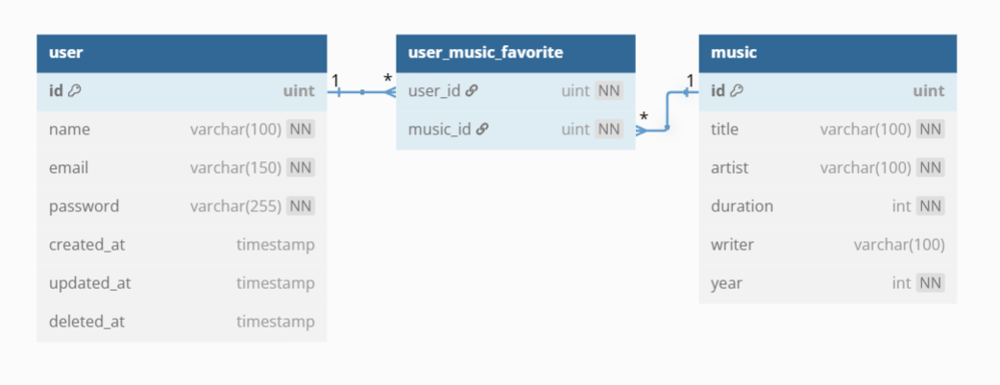

<!-- @format -->

# **REST API MUSIC**

Repository ini untuk test challenge **Backend Engineer Intern DOT Indonesia**.

---

**Flow**


**ERD Schema**
(user_music_favorite adalah tabel otomatis by gorm)



[Lihat Flow Chart](https://miro.com/app/board/uXjVIx8lumg=/?moveToWidget=3458764629378649791&cot=14)

## **Fitur**

- Authentication menggunakan JWT.
- User melihat list musik.
- User menambahkan musik favorit.
- User melihat list musik favoritnya.
- User menghapus musik favorit yang sudah ada.

---

## **Teknologi yang Digunakan**

- **Golang**
- **GORM**
- **Echo Go Framework**
- **PostgreSQL**
- **Docker**
- **Docker Compose**

---

## **📦 Cara Menjalankan Proyek**

### **1. Jalankan dengan Docker Compose**

1. Clone repository ini:
   ```bash
   git clone https://github.com/claireglowup/dot-go.git
   cd dot-go
   ```
2. **UBAH FILE .ENV.EXAMPLE JADI .ENV**

3. Bangun dan jalankan container:
   ```bash
   docker-compose up --build
   ```

### **2. Alternatif: Jalankan dengan Makefile**

Jika Makefile tersedia, jalankan:

```bash
make start
```

## **📜 Lisensi**

Proyek ini menggunakan lisensi [MIT License](LICENSE).

---
